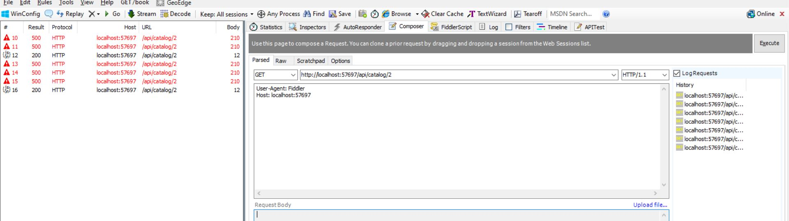

# Building Resilient API Communication in .NET CORE with POLLY

Adding the Polly NuGet Reference in Visual Studio

```bash
<PackageReference Include="Microsoft.Extensions.Http.Polly" Version="2.1.0" />
```

## Normal API Request Without Polly

http://localhost:57697/api/catalog/2

- Catalog controller returns successfull response 200 when only one of out four requests will succeed.



## Retry n Times

http://localhost:57697/api/retry/catalog/2

- Catalog controller returns 200 with same request and retry internally consecutive three times to internal api and then get the response.

 


- Write a retry policy with handle and it's behaviour, apply to the httpClient.


 

## Wait and Retry

http://localhost:57697/api/waitnretry/catalog/2

- Catalog controller returns 200 with same request and retry internally 3 consecutive times on different timespan to internal api and then get the response.

 


- Write a wait n retry policy with handle and it's behaviour, apply to the httpClient.


 


## Circuit Breaker

http://localhost:57697/api/circuitbreaker/catalog/2

- This policy can be configured in a way that a certain amount of exceptions “break” the application’s flow. 
- After getting n number of consecutive exceptions it breaks the circuit for a while and then try again after sometime.


- Write a wait n retry policy with handle and it's behaviour, apply to the httpClient.


 
